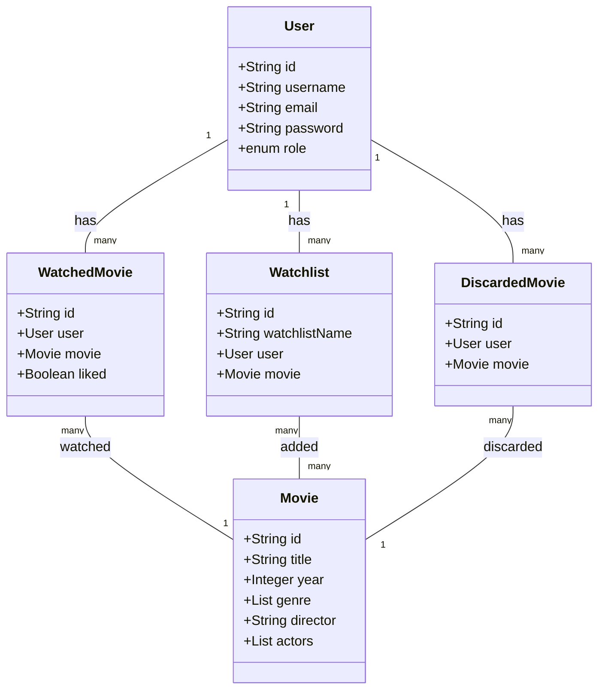

```mermaid
classDiagram
    class User {
        +String id
        +String username
        +String email
        +String password
        +enum role
    }

    class Movie {
        +String id
        +String title
        +Integer year
        +List<String> genre
        +String director
        +List<String> actors
    }

    class WatchedMovie {
        +String id
        +User user
        +Movie movie
        +Boolean liked
    }

    class Watchlist {
        +String id
        +String watchlistName
        +User user
        +Movie movie
    }

    class DiscardedMovie {
        +String id
        +User user
        +Movie movie
    }

    %% Relaciones
    User "1" -- "many" WatchedMovie : has
    User "1" -- "many" Watchlist : has
    User "1" -- "many" DiscardedMovie : has
    WatchedMovie "many" -- "1" Movie : watched
    Watchlist "many" -- "many" Movie : added
    DiscardedMovie "many" -- "1" Movie : discarded

```
