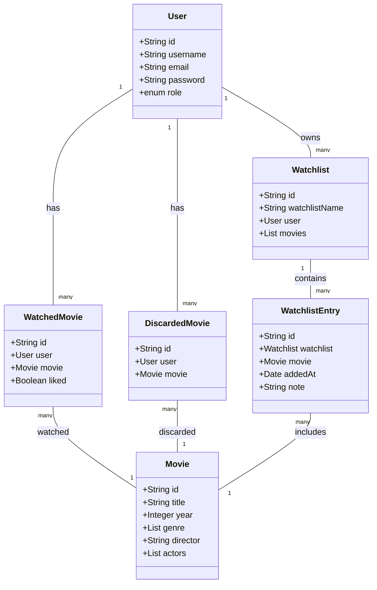

```mermaid
classDiagram
    class User {
        +String id
        +String username
        +String email
        +String password
        +enum role
    }

    class Movie {
        +String id
        +String title
        +Integer year
        +List<String> genre
        +String director
        +List<String> actors
    }

    class WatchedMovie {
        +String id
        +User user
        +Movie movie
        +Boolean liked
    }

    class Watchlist {
        +String id
        +String watchlistName
        +User user
        +List<Movie> movies
    }

    class WatchlistEntry {
        +String id
        +Watchlist watchlist
        +Movie movie
        +Date addedAt
        +String note
    }

    class DiscardedMovie {
        +String id
        +User user
        +Movie movie
    }

    %% Relaciones
    User "1" -- "many" WatchedMovie : has
    User "1" -- "many" DiscardedMovie : has
    WatchedMovie "many" -- "1" Movie : watched
    DiscardedMovie "many" -- "1" Movie : discarded
    User "1" -- "many" Watchlist : owns
    Watchlist "1" -- "many" WatchlistEntry : contains
    WatchlistEntry "many" -- "1" Movie : includes

```
